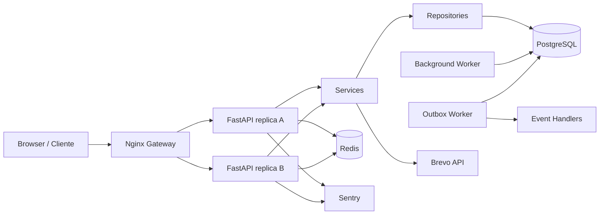

# Locadora

[](https://github.com/Jefferson21092008/locadora-fastapi/actions/workflows/ci.yml)

Sistema completo de gestão de locadora de veículos desenvolvido em **Python + FastAPI**, com frontend web, PostgreSQL, Redis, autenticação segura, processamento assíncrono, observabilidade, testes automatizados e suporte validado a escala horizontal.

O projeto começou como uma aplicação de domínio e evoluiu para um **monólito modular orientado a serviços**, mantendo separação clara entre HTTP, regras de negócio, persistência e infraestrutura. A prioridade foi evoluir a arquitetura com evidência: testes, migrations, concorrência real em PostgreSQL, carga, Docker e múltiplas réplicas.

## Demonstração

- **Aplicação:** https://locadora-fastapi.onrender.com/app/
- **API:** https://locadora-fastapi.onrender.com
- **Swagger / OpenAPI:** https://locadora-fastapi.onrender.com/docs
- **Health check:** https://locadora-fastapi.onrender.com/health

> O deploy público atual é single-instance. O suporte a múltiplas réplicas foi validado localmente com Docker Compose + Nginx, PostgreSQL e Redis compartilhados.

## O que este projeto demonstra

- construção de API REST com FastAPI e Pydantic;
- arquitetura em camadas com **Router → Service → Repository → SQLAlchemy**;
- modelagem relacional e migrations com Alembic;
- autenticação com JWT, refresh token rotativo e sessões persistentes;
- autorização por permissões com RBAC;
- transações, rollback, locks pessimistas e proteção contra race conditions;
- cache e rate limiting distribuídos com Redis;
- jobs persistentes e workers separados do processo HTTP;
- eventos de aplicação e **Transactional Outbox**;
- observabilidade com logs estruturados, request ID e Sentry;
- Docker hardening e ambientes separados de development/test/staging/production;
- CI com PostgreSQL real, coverage mínimo, Ruff, pip-audit e Playwright;
- testes de carga e decisões de otimização baseadas em medição;
- arquitetura preparada e validada para múltiplas réplicas HTTP.

## Arquitetura



A aplicação permanece um **monólito modular**. PostgreSQL é a fonte de verdade para dados de negócio, sessões, jobs e eventos outbox. Redis é usado apenas para estado descartável/distribuído, como cache e rate limiting. Workers são processos separados, mas compartilham o mesmo domínio e banco.

A decisão de não decompor o sistema em microserviços está documentada em [`docs/decisoes-arquiteturais.md`](docs/decisoes-arquiteturais.md).

## Principais funcionalidades

### Operação da locadora

- cadastro, edição, ativação e desativação de clientes;
- cadastro, busca, edição e controle de disponibilidade de veículos;
- criação e devolução de aluguéis;
- cálculo de diárias, atraso e quilometragem;
- reservas futuras com validação de disponibilidade;
- manutenção preventiva/corretiva e histórico por veículo;
- vistorias de retirada e devolução;
- registro de combustível, danos, multas e cauções;
- pagamentos, liquidações adicionais e estornos;
- relatórios operacionais e financeiros;
- dashboard administrativo com métricas e rankings;
- exportação de relatórios em CSV, Excel e PDF;
- notificações persistentes e lembretes automáticos.

### Autenticação e segurança

- access token JWT de curta duração;
- access token mantido apenas em memória no frontend;
- refresh token em cookie `HttpOnly`;
- refresh tokens rotativos e persistidos somente por hash SHA-256;
- sessões revogáveis e invalidação após troca de senha;
- recuperação de senha por e-mail via Brevo;
- tokens de recuperação temporários, de uso único e armazenados por hash;
- RBAC centralizado por permissões;
- rate limiting em login e recuperação de senha;
- headers de segurança HTTP;
- audit log persistente para ações sensíveis;
- secrets exclusivamente por variáveis de ambiente;
- auditoria de dependências com `pip-audit` e atualizações via Dependabot.

## Stack

| Área | Tecnologias |
| --- | --- |
| Backend | Python 3.14, FastAPI, Uvicorn, Pydantic |
| Persistência | SQLAlchemy 2, Alembic, PostgreSQL, SQLite |
| Cache/distribuição | Redis / Valkey |
| Autenticação | PyJWT, cookies HttpOnly, sessões persistentes |
| Frontend | HTML, CSS, JavaScript |
| Infra | Docker, Docker Compose, Nginx, Render, Neon |
| Observabilidade | logs JSON, Request ID, Sentry |
| E-mail | Brevo Transactional Email API |
| Qualidade | pytest, pytest-cov, Playwright, Ruff, pip-audit |
| CI/CD | GitHub Actions, Dependabot |

## Estrutura do repositório

```text
.
├── api/
│   ├── routers/             # endpoints HTTP
│   ├── schemas/             # contratos Pydantic
│   ├── main.py              # composição FastAPI
│   ├── observabilidade.py   # request ID e logs HTTP
│   ├── rate_limit.py
│   └── ...
├── frontend/                # HTML/CSS/JS servido pela FastAPI
├── modulos/
│   ├── models/              # modelos SQLAlchemy
│   ├── repositories/        # acesso a dados
│   ├── servicos/            # regras de aplicação
│   ├── container.py         # composição/injeção de dependências
│   ├── eventos.py           # contratos de eventos
│   ├── outbox.py            # mensageria durável
│   └── ...
├── migrations/              # migrations Alembic
├── scripts/
│   ├── horizontal/          # validação de múltiplas réplicas
│   ├── performance/         # carga e comparação de resultados
│   └── legacy/              # histórico da migração antiga
├── infra/nginx/             # gateway local para escala horizontal
├── docs/                    # arquitetura e runbooks
├── tests/                   # unitários, integração, estrutura e E2E
├── compose.yaml
├── Dockerfile
└── render.yaml
```

## Fluxo de uma requisição

```text
Frontend / cliente HTTP
        ↓
FastAPI Router
        ↓
Dependências de autenticação/autorização
        ↓
Pydantic Schema
        ↓
Service
        ↓
Repository
        ↓
SQLAlchemy
        ↓
PostgreSQL / SQLite
```

As regras de negócio ficam nos Services e módulos de domínio. Routers não acessam SQL diretamente e Repositories não concentram regras HTTP.

## Banco de dados e consistência

O projeto usa SQLite para cenários locais simples e PostgreSQL como banco relacional principal em produção e testes de integração.

O Alembic controla a evolução do schema. O head atual é:

```text
20261006_0011_eventos_outbox
```

As operações críticas usam transações explícitas. Em PostgreSQL, fluxos concorrentes de aluguel, reserva, manutenção e pagamento usam `SELECT ... FOR UPDATE` quando necessário. A migration de consistência também cria uma restrição única parcial para impedir mais de um aluguel ativo para o mesmo veículo.

Isso fornece duas camadas de proteção:

1. revalidação de estado dentro da transação;
2. invariantes críticas reforçadas pelo próprio banco.

Detalhes: [`docs/concorrencia-consistencia.md`](docs/concorrencia-consistencia.md).

## Eventos e mensageria

O projeto usa eventos de aplicação para desacoplar efeitos secundários das regras principais. Para eventos que precisam sobreviver a reinícios e atravessar processos, utiliza **Transactional Outbox**.

```text
Mutação de negócio + evento
          ↓
     mesmo COMMIT
          ↓
   eventos_outbox
          ↓
     OutboxWorker
          ↓
   Event handlers
```

A entrega é **at-least-once**. O worker implementa retry/backoff e, no PostgreSQL, reserva lotes com `FOR UPDATE SKIP LOCKED`, permitindo múltiplos workers sem selecionar a mesma mensagem simultaneamente.

Detalhes: [`docs/mensageria-outbox.md`](docs/mensageria-outbox.md).

## Cache, rate limiting e jobs

Redis/Valkey é utilizado para:

- cache-aside do dashboard;
- contadores compartilhados do rate limiter;
- estado distribuído que pode ser reconstruído.

Redis **não é a fonte de verdade** de dados de negócio. Jobs persistentes e eventos outbox permanecem em PostgreSQL.

Os workers podem ser executados separados da API:

```bash
python -m modulos.background_worker
python -m modulos.outbox_worker
```

## Escala horizontal

No modo horizontal, a aplicação exige PostgreSQL e Redis compartilhados, desativa workers embutidos e impede que cada réplica execute migrations por conta própria.

O Compose fornece um gateway Nginx e permite subir múltiplas APIs:

```bash
docker compose --env-file .env.docker up -d --build --scale api=2 --scale outbox-worker=2
python -m scripts.horizontal.check_replicas --requests 30 --min-instances 2
```

Cada resposta HTTP inclui `X-Locadora-Instance`, permitindo observar qual réplica respondeu. O endpoint `/ready` valida dependências necessárias para a instância receber tráfego.

Na validação final, 30 requisições foram distribuídas igualmente entre duas réplicas, e o mesmo teste foi repetido com sessão autenticada, comprovando que a autenticação não depende de memória local de uma única API.

Detalhes: [`docs/escala-horizontal.md`](docs/escala-horizontal.md).

## Observabilidade

Cada requisição recebe um `X-Request-ID`. Os logs HTTP são estruturados em JSON e incluem método, caminho, status, duração e identificação da instância.

A integração opcional com Sentry captura exceções sem enviar corpo da requisição, cookies, headers, query string ou dados de usuário. O `request_id` permite correlacionar logs e erros.

A aplicação também mantém audit logs de ações sensíveis, registrando metadados como ator, ação, recurso e horário, sem persistir valores secretos.

## Docker e hardening

A imagem de runtime usa build multi-stage e executa com usuário não privilegiado (`UID/GID 10001`). O Compose aplica, entre outras medidas:

- filesystem somente leitura nos processos da aplicação;
- `cap_drop: ALL`;
- `no-new-privileges`;
- `/tmp` temporário;
- limites de PIDs;
- healthcheck/readiness para APIs e gateway;
- migrations em processo dedicado no ambiente horizontal.

Detalhes: [`docs/docker-hardening.md`](docs/docker-hardening.md).

## Executando com Docker Compose

Crie o arquivo privado de configuração:

```bash
cp .env.docker.example .env.docker
```

No Windows CMD:

```bat
copy .env.docker.example .env.docker
notepad .env.docker
```

Preencha senhas e secrets apenas no arquivo local. Nunca versione `.env` ou `.env.docker`.

Valide e suba o ambiente:

```bash
docker compose --env-file .env.docker config --quiet
docker compose --env-file .env.docker up -d --build
```

Para duas réplicas da API:

```bash
docker compose --env-file .env.docker up -d --build --scale api=2 --scale outbox-worker=2
```

Verifique os serviços:

```bash
docker compose --env-file .env.docker ps
```

Acesse:

- frontend: `http://127.0.0.1:8000/app/`
- Swagger: `http://127.0.0.1:8000/docs`
- health: `http://127.0.0.1:8000/health`
- readiness: `http://127.0.0.1:8000/ready`

Para encerrar preservando o volume PostgreSQL:

```bash
docker compose --env-file .env.docker down
```

Para apagar também os dados locais do Compose:

```bash
docker compose --env-file .env.docker down -v
```

## Executando localmente sem Docker

Crie e ative um ambiente virtual:

```bash
python -m venv .venv
```

Windows CMD:

```bat
.venv\Scripts\activate
```

Instale as dependências de desenvolvimento:

```bash
python -m pip install -r requirements-dev.txt
```

Copie `.env.example` para `.env` e configure, no mínimo:

```env
LOCADORA_ADMIN_USUARIO=admin
LOCADORA_ADMIN_SENHA=coloque_uma_senha_forte_aqui
LOCADORA_JWT_SECRET=coloque_uma_chave_secreta_longa_aqui
LOCADORA_DATABASE_URL=sqlite:///dados/locadora.db
```

Aplique as migrations:

```bash
python -m alembic upgrade head
```

Inicie a API:

```bash
python -m uvicorn api.main:app --reload
```

A CLI continua disponível com:

```bash
python carros.py
```

## Testes e qualidade

Validação de fechamento do projeto:

| Verificação | Resultado |
| --- | ---: |
| Suíte convencional | **844 passed** |
| Coverage | **86,73%** |
| Meta mínima de coverage | **85%** |
| E2E Chromium | **2 passed** |
| Ruff | **verde** |
| pip-audit | **nenhuma vulnerabilidade conhecida** |
| PostgreSQL real | **9 testes de integração passaram** |
| Escala horizontal | **2 réplicas + sessão autenticada validadas** |

Comandos principais:

```bash
python -m ruff check .
python -m pytest --ignore=tests/e2e
python -m pytest --ignore=tests/e2e --cov=api --cov=modulos --cov-report=term-missing --cov-fail-under=85
python -m pytest tests/e2e --browser chromium -v
python -m pip_audit -r requirements.txt --progress-spinner off
```

Os testes PostgreSQL usam `LOCADORA_TEST_DATABASE_URL` e devem apontar somente para banco descartável.

Evidências e critérios de validação: [`docs/validacao-final.md`](docs/validacao-final.md).

## CI

O GitHub Actions executa em Pull Requests para `main` e em pushes integrados nessa branch. O pipeline inclui:

- instalação e `pip check`;
- Ruff;
- `pip-audit`;
- PostgreSQL 18 temporário;
- Alembic `upgrade head`;
- pytest com coverage mínimo de 85%;
- E2E com Playwright/Chromium;
- build da imagem Docker;
- validação do Compose;
- verificações de hardening da imagem.

## Backup e recuperação

O projeto fornece backup lógico independente do provedor:

```bash
python -m modulos.backup_cli criar
python -m modulos.backup_cli listar
python -m modulos.backup_cli verificar backups/ARQUIVO
python -m modulos.backup_cli restaurar backups/ARQUIVO --destino-url URL --confirmar
```

PostgreSQL usa `pg_dump`/`pg_restore`; SQLite usa sua API nativa de backup. Os artefatos recebem checksum SHA-256 e metadata sem credenciais.

Runbook: [`docs/backup-recuperacao.md`](docs/backup-recuperacao.md).

## Ambientes

`LOCADORA_AMBIENTE` aceita:

- `development`
- `test`
- `staging`
- `production`

Staging e produção recusam fallback silencioso para SQLite e exigem URL pública HTTPS. Os arquivos `.env.*.example` documentam configurações seguras sem incluir secrets reais.

Detalhes: [`docs/ambientes.md`](docs/ambientes.md).

## Deploy atual

A produção pública usa Render + Neon PostgreSQL. O frontend é servido pela própria FastAPI.

O `render.yaml` representa o deploy atual **single-instance**, com workers embutidos. O modo multi-réplica exige separar migrations e workers em processos próprios, como demonstrado no Compose da validação horizontal.

Secrets como JWT, senha do administrador, credenciais PostgreSQL, chave Brevo e DSN do Sentry não ficam no repositório.

## Performance

O projeto possui runner de carga assíncrono com métricas de throughput, sucesso, média, mediana, p95, p99 e máximo. Há cenários para health, veículos, dashboard com cache, dashboard forçando banco e carga mista.

A etapa de performance teve uma decisão importante: duas otimizações experimentais foram revertidas porque o ambiente local apresentou variação alta e os ganhos não foram consistentes. A infraestrutura de benchmark foi mantida para permitir comparações reproduzíveis no futuro.

Isso evita otimização prematura e mantém mudanças de performance baseadas em evidência.

Detalhes: [`docs/testes-carga-otimizacao.md`](docs/testes-carga-otimizacao.md).

## Decisões arquiteturais importantes

Algumas decisões deliberadas do projeto:

- **monólito modular em vez de microserviços:** a complexidade atual não justifica fronteiras de deploy independentes;
- **PostgreSQL como fonte de verdade:** jobs, sessões e outbox precisam de durabilidade;
- **Redis apenas para estado reconstruível:** cache e rate limit podem degradar sem corromper o domínio;
- **Transactional Outbox em vez de broker prematuro:** garante atomicidade entre mutação e evento com a infraestrutura já existente;
- **locks seletivos em vez de isolamento global mais alto:** protege invariantes críticas sem penalizar todas as transações;
- **workers separados em escala horizontal:** evita duplicar schedulers e processamento em cada réplica HTTP;
- **migration como operação única:** múltiplas réplicas não disputam Alembic durante startup.

A análise completa, incluindo trade-offs e gatilhos que justificariam microserviços no futuro, está em [`docs/decisoes-arquiteturais.md`](docs/decisoes-arquiteturais.md).

## Documentação

- [`docs/arquitetura.md`](docs/arquitetura.md) — arquitetura detalhada;
- [`docs/decisoes-arquiteturais.md`](docs/decisoes-arquiteturais.md) — decisões e trade-offs;
- [`docs/validacao-final.md`](docs/validacao-final.md) — evidências de qualidade e validação;
- [`docs/apresentacao-portfolio.md`](docs/apresentacao-portfolio.md) — roteiro para apresentar o projeto em entrevista;
- [`docs/escala-horizontal.md`](docs/escala-horizontal.md) — múltiplas réplicas e operação;
- [`docs/mensageria-outbox.md`](docs/mensageria-outbox.md) — Transactional Outbox;
- [`docs/concorrencia-consistencia.md`](docs/concorrencia-consistencia.md) — consistência transacional;
- [`docs/testes-carga-otimizacao.md`](docs/testes-carga-otimizacao.md) — performance;
- [`docs/docker-hardening.md`](docs/docker-hardening.md) — segurança do container;
- [`docs/backup-recuperacao.md`](docs/backup-recuperacao.md) — backup e restore;
- [`docs/ambientes.md`](docs/ambientes.md) — development/test/staging/production;
- [`docs/design-system.md`](docs/design-system.md) — frontend e design system.

## Estado do projeto

A trilha principal de evolução arquitetural está **concluída**.

O próximo passo não é adicionar tecnologia por adicionar. Novas mudanças devem responder a uma necessidade observável: crescimento de carga, equipes independentes, requisitos de disponibilidade, novos consumidores de eventos ou evolução funcional do produto.

Por isso, microserviços não foram adotados como “etapa obrigatória”. O projeto já possui fronteiras internas, eventos, outbox, workers e infraestrutura suficientes para evoluir com segurança caso essa necessidade apareça.
