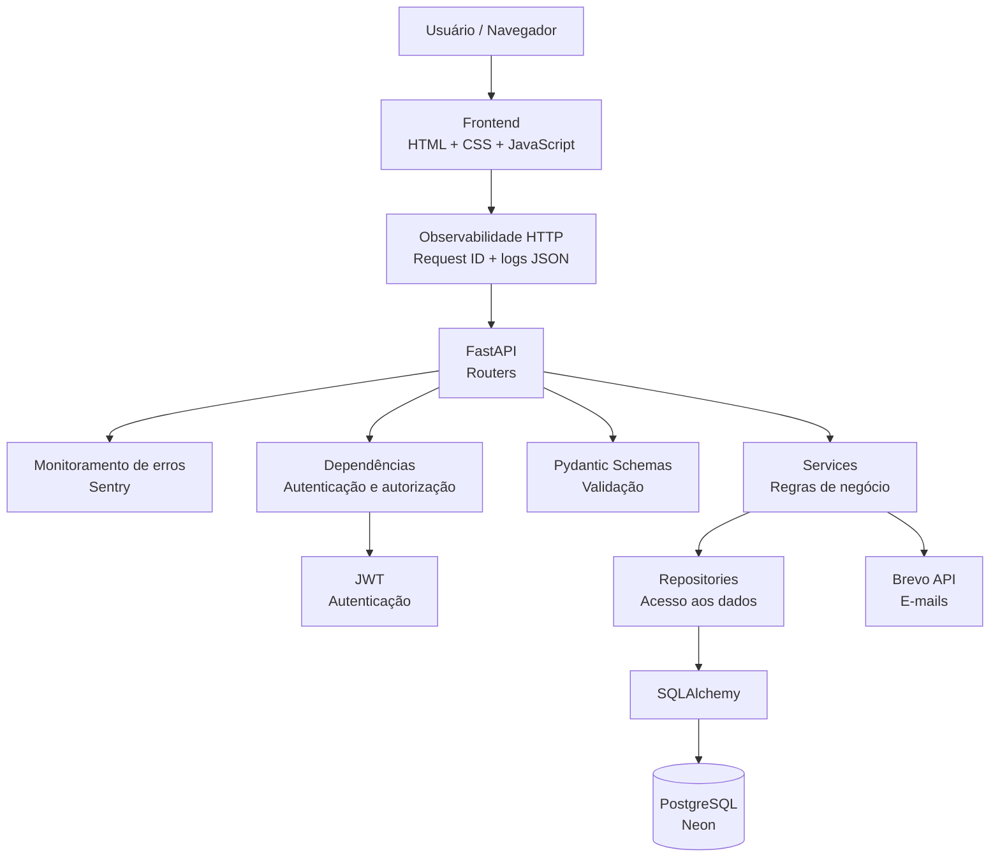

# Arquitetura da Locadora

Este documento apresenta a arquitetura atual da Locadora, mostrando como os principais componentes da aplicação se relacionam desde o frontend até o banco de dados e os serviços externos.

## Visão geral

A Locadora utiliza uma arquitetura em camadas para separar responsabilidades entre interface, API, regras de negócio e persistência de dados.



## Observabilidade HTTP

A camada HTTP gera um `request_id` UUID para cada requisição e devolve o mesmo valor no cabeçalho `X-Request-ID`. Ao final do processamento, a aplicação registra uma linha JSON com os campos principais da requisição:

- evento;
- request ID;
- método HTTP;
- caminho da rota;
- status HTTP;
- duração em milissegundos.

Os logs não incluem query string, cabeçalhos ou corpo da requisição. Eventos importantes de autenticação também são registrados com um conjunto restrito de campos, evitando o armazenamento de senha, token JWT ou token de recuperação.

Exemplo conceitual:

```json
{"level":"INFO","event":"http.request","request_id":"...","method":"GET","path":"/health","status_code":200,"duration_ms":4.12}
```

## Monitoramento de erros

A aplicação possui integração opcional com Sentry para capturar exceções não tratadas em produção com stack trace e contexto técnico. A integração só é ativada quando `LOCADORA_SENTRY_DSN` está configurada, portanto desenvolvimento local e testes continuam funcionando sem depender do serviço externo.

O `request_id` criado pela camada de observabilidade é associado ao escopo isolado da requisição no Sentry. Isso permite correlacionar uma exceção exibida no monitoramento com a linha correspondente dos logs estruturados.

Para reduzir exposição de dados, a configuração usa `send_default_pii=False` e um filtro `before_send`. Antes do envio, são removidos body, query string, cookies, headers, dados de ambiente da requisição e dados de usuário. A URL é mantida apenas sem query string.

Variáveis usadas:

- `LOCADORA_SENTRY_DSN`: ativa o envio de erros ao projeto Sentry;
- `LOCADORA_AMBIENTE`: identifica o ambiente, como `development`, `test` ou `production`.

Nesta etapa o foco é monitoramento de **erros**, não tracing de desempenho. Por isso `traces_sample_rate` permanece em `0.0`.
