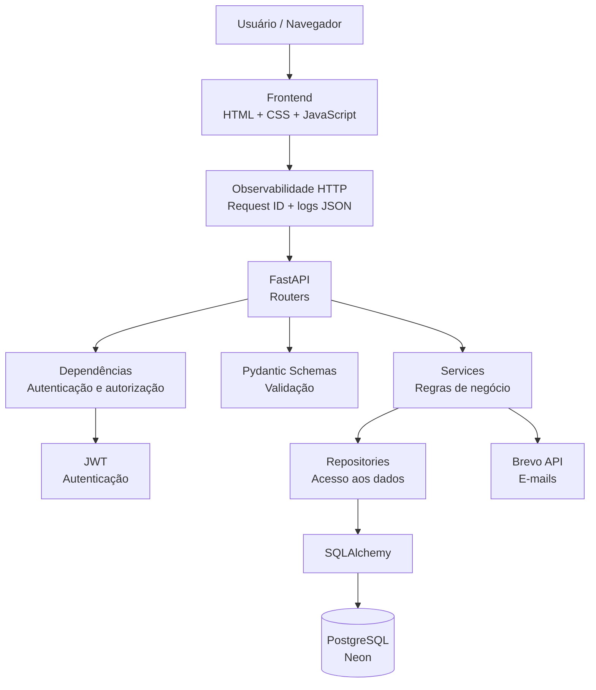

# Arquitetura da Locadora

Este documento apresenta a arquitetura atual da Locadora, mostrando como os principais componentes da aplicação se relacionam desde o frontend até o banco de dados e os serviços externos.

## Visão geral

A Locadora utiliza uma arquitetura em camadas para separar responsabilidades entre interface, API, regras de negócio e persistência de dados.



## Observabilidade HTTP

A camada HTTP gera um `request_id` UUID para cada requisição e devolve o mesmo valor no cabeçalho `X-Request-ID`. Ao final do processamento, a aplicação registra uma linha JSON com os campos principais da requisição:

- evento;
- request ID;
- método HTTP;
- caminho da rota;
- status HTTP;
- duração em milissegundos.

Os logs não incluem query string, cabeçalhos ou corpo da requisição. Eventos importantes de autenticação também são registrados com um conjunto restrito de campos, evitando o armazenamento de senha, token JWT ou token de recuperação.

Exemplo conceitual:

```json
{"level":"INFO","event":"http.request","request_id":"...","method":"GET","path":"/health","status_code":200,"duration_ms":4.12}
```
