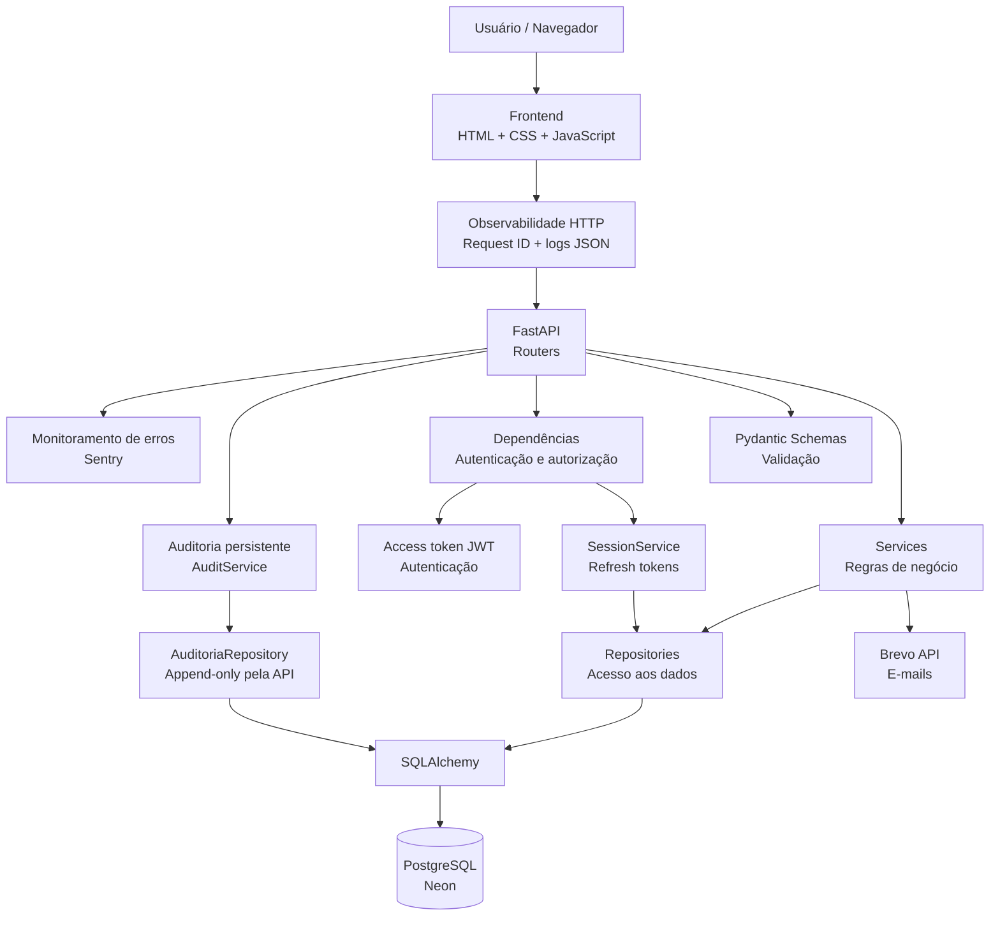

# Arquitetura da Locadora

Este documento apresenta a arquitetura atual da Locadora, mostrando como os principais componentes da aplicação se relacionam desde o frontend até o banco de dados e os serviços externos.

## Visão geral

A Locadora utiliza uma arquitetura em camadas para separar responsabilidades entre interface, API, regras de negócio e persistência de dados.



## Observabilidade HTTP

A camada HTTP gera um `request_id` UUID para cada requisição e devolve o mesmo valor no cabeçalho `X-Request-ID`. Ao final do processamento, a aplicação registra uma linha JSON com os campos principais da requisição:

- evento;
- request ID;
- método HTTP;
- caminho da rota;
- status HTTP;
- duração em milissegundos.

Os logs não incluem query string, cabeçalhos ou corpo da requisição. Eventos importantes de autenticação também são registrados com um conjunto restrito de campos, evitando o armazenamento de senha, token JWT ou token de recuperação.

Exemplo conceitual:

```json
{"level":"INFO","event":"http.request","request_id":"...","method":"GET","path":"/health","status_code":200,"duration_ms":4.12}
```

## Monitoramento de erros

A aplicação possui integração opcional com Sentry para capturar exceções não tratadas em produção com stack trace e contexto técnico. A integração só é ativada quando `LOCADORA_SENTRY_DSN` está configurada, portanto desenvolvimento local e testes continuam funcionando sem depender do serviço externo.

O `request_id` criado pela camada de observabilidade é associado ao escopo isolado da requisição no Sentry. Isso permite correlacionar uma exceção exibida no monitoramento com a linha correspondente dos logs estruturados.

Para reduzir exposição de dados, a configuração usa `send_default_pii=False` e um filtro `before_send`. Antes do envio, são removidos body, query string, cookies, headers, dados de ambiente da requisição e dados de usuário. A URL é mantida apenas sem query string.

Variáveis usadas:

- `LOCADORA_SENTRY_DSN`: ativa o envio de erros ao projeto Sentry;
- `LOCADORA_AMBIENTE`: identifica o ambiente, como `development`, `test` ou `production`.

Nesta etapa o foco é monitoramento de **erros**, não tracing de desempenho. Por isso `traces_sample_rate` permanece em `0.0`.

## Auditoria persistente

A Etapa 7 adiciona uma trilha persistente para ações sensíveis realizadas por usuários autenticados. O objetivo é responder **quem fez**, **o que fez**, **em qual recurso** e **quando**, mantendo correlação com o `request_id` da observabilidade HTTP.

Cada registro contém apenas metadados controlados:

- ID e nome de usuário do ator;
- perfil (`admin` ou `cliente`);
- ação, como `veiculo.editado` ou `cliente.desativado`;
- tipo e identificador do recurso afetado;
- nomes dos campos alterados, sem armazenar os valores;
- `request_id`;
- data/hora em UTC.

A tabela `audit_logs` é escrita pelo `AuditoriaRepository` e consultada por meio de `GET /api/v1/auditoria`, rota restrita a administradores. A API não oferece endpoints para editar ou excluir registros de auditoria.

São auditadas, nesta etapa, ações autenticadas de alteração de estado: cadastro/edição/ativação de veículos, ativação/desativação de clientes, abertura/finalização de manutenção, criação/devolução de aluguel, criação/cancelamento de reserva e alteração do próprio nome de usuário. Login e recuperação de senha continuam registrados como eventos estruturados da camada de observabilidade, sem duplicação na tabela de auditoria.

Por segurança, valores de campos não entram no histórico e nomes sensíveis como senha, token, JWT, segredo, API key ou DSN são filtrados pelo `AuditoriaService`.

### Consistência da auditoria

Os Services atuais confirmam suas próprias transações de negócio antes do registro de auditoria. Por isso, uma falha isolada ao gravar `audit_logs` não pode fazer a API responder `500` depois que a operação principal já foi confirmada no banco. Nessa situação, a aplicação registra `audit.write_failed` nos logs estruturados e envia a exceção ao Sentry.

Esse é um compromisso explícito da arquitetura atual. Uma garantia atômica entre ação de negócio e audit log exigiria uma unidade de trabalho/transação compartilhada e pode ser tratada na etapa futura de concorrência e consistência transacional.
## Versionamento da API

A Etapa 8 estabelece `/api/v1` como prefixo canônico da API HTTP. Os mesmos Routers continuam concentrando endpoints e regras de dependência; o versionamento é aplicado no registro dos Routers em `api/main.py`, evitando duplicar Services, Repositories ou regras de negócio.

Fluxo canônico:

```text
Frontend
   ↓
/api/v1
   ↓
FastAPI Routers
   ↓
Services
   ↓
Repositories
```

Durante a migração, os caminhos antigos sem `/api/v1` permanecem registrados com `include_in_schema=False`. Dessa forma, consumidores antigos continuam funcionando temporariamente, mas Swagger/OpenAPI apresentam apenas a versão canônica.

O frontend centraliza o prefixo em `frontend/js/api.js`, por meio de `API_BASE = "/api/v1"`. Assim, os módulos de tela continuam chamando funções como `login()` e `getVehicles()` sem conhecer a estratégia de versionamento.

Rotas operacionais e de infraestrutura não são versionadas: `/health` continua estável para o Render, e `/app` continua sendo o ponto de entrada do frontend estático.

## Refresh tokens e sessões persistentes

A Etapa 9 separa a autenticação em dois componentes. O **access token** continua sendo um JWT de curta duração enviado no cabeçalho `Authorization`. O **refresh token** passa a representar uma sessão persistente e é mantido somente em cookie `HttpOnly`, impedindo que o JavaScript do frontend leia seu valor diretamente.

Fluxo principal:

```text
login válido
   ↓
SessaoService cria refresh token aleatório
   ↓
SHA-256(refresh token) → tabela sessoes
refresh token puro → cookie HttpOnly
   ↓
access token JWT com sid da sessão
   ↓
JWT expira
   ↓
POST /api/v1/auth/refresh
   ↓
refresh token é validado e rotacionado
   ↓
novo access token + novo cookie HttpOnly
```

A tabela `sessoes` guarda `usuario_id`, hash do refresh token, criação, expiração, último uso e estado de revogação. O valor puro do refresh token não é persistido. A rotação substitui o hash anterior, de forma que um refresh token já utilizado não pode ser reutilizado.

Novos access tokens incluem a claim `sid`. `get_usuario_atual` continua validando assinatura, expiração e usuário, mas também consulta a sessão quando `sid` está presente. Isso faz com que logout, revogação individual ou revogação de todas as sessões invalide imediatamente os novos access tokens relacionados. Durante a transição, JWTs emitidos antes da Etapa 9 e sem `sid` continuam aceitos somente até a expiração natural.

O frontend mantém o access token somente em memória dentro de `frontend/js/api.js`; o JWT não é gravado em `sessionStorage` nem `localStorage`. Depois de um reload ou de uma navegação para outra página do frontend, `restoreSession()` usa o refresh token HttpOnly para emitir um novo access token e o conserva apenas durante a vida daquela página. Ao receber `401`, a camada de API também tenta uma única renovação automática e repete a requisição original. Uma Promise compartilhada evita refresh concorrente dentro da mesma página. Quando `navigator.locks` está disponível, o frontend também serializa renovações entre abas do mesmo navegador para reduzir corridas durante a rotação do cookie.

A redefinição de senha revoga as sessões persistentes da conta antes da troca da credencial. Dessa forma, uma sessão já autenticada não permanece válida após uma recuperação de senha.
## RBAC granular por permissões

A Etapa 10 mantém os papéis `admin` e `cliente`, mas remove a necessidade de as rotas conhecerem diretamente esses nomes para decidir autorização. `modulos/permissoes.py` concentra a matriz RBAC e expõe permissões atômicas por operação.

Fluxo de autorização:

```text
JWT válido
   ↓
get_usuario_atual
   ↓
exigir_permissao(Permissao.X)
   ↓
matriz papel → permissões
   ↓
permitido → endpoint
negado    → HTTP 403
```

Exemplos de capacidades administrativas são `clientes:ler`, `clientes:gerenciar_status`, `veiculos:criar`, `veiculos:editar`, `alugueis:ler`, `manutencoes:finalizar`, `relatorios:ler` e `auditoria:ler`. O cliente recebe somente capacidades do próprio fluxo, como `alugueis:criar`, `alugueis:proprios:ler`, `alugueis:devolver`, `conta:renomear` e `sessoes:gerenciar`.

`get_cliente_atual` continua existindo para resolver o perfil de domínio do cliente e validar se ele está ativo. A autorização de capacidade, porém, é tratada separadamente pela dependência RBAC. Isso evita misturar identificação do ator com a decisão de quais operações ele pode executar.

`GET /api/v1/auth/me` devolve a lista de permissões efetivas. O frontend usa essa lista para decidir quais controles e páginas administrativas devem ser apresentados. Essa lógica de interface é apenas uma camada de experiência do usuário; a API repete a validação em cada operação protegida e continua sendo a fonte de verdade.

Como os papéis existentes não mudam e as permissões são derivadas em código, a Etapa 10 não altera o schema do banco e não exige migration.


## Checkpoint de segurança HTTP

Após a conclusão de sessões e RBAC, a aplicação passou por um checkpoint de hardening HTTP. Um middleware dedicado adiciona `X-Content-Type-Options`, `X-Frame-Options`, `Referrer-Policy`, `Permissions-Policy` e `Cross-Origin-Opener-Policy` às respostas. O frontend próprio em `/app` também recebe uma Content Security Policy que restringe scripts e conexões à mesma origem e impede enquadramento da interface por outros sites.

Rotas de autenticação recebem `Cache-Control: no-store` e `Pragma: no-cache`. A página de redefinição de senha usa `Referrer-Policy: no-referrer`, não permite cache e remove o token de recuperação da query string assim que o JavaScript o transfere para o formulário. Em produção HTTPS, a aplicação também envia HSTS com validade de um ano.

A validação de JWT passa a exigir explicitamente `sub`, `iat` e `exp`, além da verificação de assinatura e expiração já existente.

## Hardening do armazenamento do access token

O frontend não persiste mais o access token em Web Storage. `frontend/js/api.js` mantém o JWT somente em uma variável de módulo e continua enviando-o pelo cabeçalho `Authorization: Bearer` nas rotas protegidas.

Fluxo após login e durante navegação:

```text
login válido
   ↓
access token → memória da página
refresh token → cookie HttpOnly
   ↓
navegação / reload
   ↓
memória é descartada
   ↓
restoreSession()
   ↓
POST /api/v1/auth/refresh
   ↓
novo access token → memória da nova página
```

Esse desenho reduz a exposição do JWT a persistência no navegador sem transformar todas as rotas protegidas em autenticação baseada em cookie. A renovação utiliza uma Promise por página e, quando suportado pelo navegador, Web Locks entre abas para reduzir tentativas simultâneas de rotacionar o mesmo refresh token. Assim, as operações de negócio continuam exigindo o cabeçalho Bearer, enquanto o cookie HttpOnly é usado somente para renovação e encerramento da sessão. O backend continua sendo compatível com clientes de API que utilizam diretamente o access token retornado pelo login.

## Design system e layout base

A Etapa 11 consolida a camada visual sem introduzir framework de UI. `frontend/css/styles.css` concentra tokens semânticos de cor, tipografia, espaçamento, raio, sombra e movimento; as telas reutilizam os componentes já existentes para botões, formulários, cards, modais, navegação e estados de interface.

Em desktop, as páginas autenticadas mantêm sidebar fixa. Em larguras menores, a navegação se transforma em uma barra superior horizontal e sticky, preservando acesso às áreas do sistema sem JavaScript adicional. Todas as páginas também expõem um link de salto para `#main-content`, melhorando navegação por teclado.

As decisões e tokens compartilhados estão documentados em [`docs/design-system.md`](design-system.md).

## Paginação e consultas server-side — trilha principal

A etapa de consultas server-side completa a busca e os filtros visuais já introduzidos durante a fase de frontend. A diferença é que o recorte deixa de ser calculado sobre uma coleção inteira no navegador e passa a ser executado na camada de persistência.

Fluxo:

```text
interface operacional
   ↓
query string: pagina / por_pagina / busca / status / ordem
   ↓
FastAPI
   ↓
Service
   ↓
Repository SQLAlchemy
   ↓
WHERE + ORDER BY + LIMIT + OFFSET
   ↓
PostgreSQL / SQLite
```

Foram adicionadas consultas dedicadas para clientes, veículos, aluguéis e manutenções. Aluguéis possuem duas variantes: uma administrativa para toda a locadora e outra vinculada ao cliente autenticado. O escopo do cliente é aplicado no repository antes da contagem e da paginação.

As respostas paginadas mantêm um contrato uniforme com `items`, `pagina`, `por_pagina`, `total`, `total_paginas` e `resumo`. O `resumo` representa o conjunto completo permitido ao usuário, enquanto `total` representa a quantidade correspondente à busca e aos filtros atuais.

As rotas de listagem anteriores não foram removidas. Elas continuam disponíveis temporariamente para compatibilidade e para fluxos internos que realmente necessitam da coleção completa. Não há migration nesta etapa: a mudança atua sobre consultas e contratos HTTP, não sobre o schema do banco.

## Dashboard administrativo — métricas agregadas

A Etapa 12 adiciona uma consulta específica para o dashboard administrativo:

```text
GET /api/v1/relatorios/dashboard
```

O fluxo segue a arquitetura existente:

```text
Dashboard
   ↓
GET /api/v1/relatorios/dashboard
   ↓
exigir_permissao(relatorios:ler)
   ↓
RelatorioService.metricas_dashboard()
   ↓
RelatorioRepository.metricas_dashboard()
   ↓
SQLAlchemy / PostgreSQL
```

O repository executa agregações no banco em vez de carregar coleções completas em memória. Ele calcula contagens por status e valores financeiros consolidados. O service mantém os cálculos derivados de negócio, como taxa da frota alugada e resultado bruto.

O dashboard visual continua único para administradores e clientes. Quando o usuário possui `relatorios:ler`, o frontend carrega o resumo administrativo; caso contrário, mantém o resumo básico de `/api/v1/status`. Isso evita expor métricas financeiras a usuários sem autorização e preserva compatibilidade com o fluxo existente.

## Exportações de relatórios — CSV, Excel e PDF

A Etapa 13 acrescenta uma camada de transformação de relatórios sem deslocar regras de negócio para o formato de arquivo.

Fluxo:

```text
Relatórios no frontend
   ↓
GET /api/v1/relatorios/resultado-por-veiculo/exportar/{formato}
   ↓
exigir_permissao(relatorios:ler)
   ↓
ExportacaoRelatoriosService
   ↓
RelatorioService.resultado_por_veiculo()
   ↓
RelatorioRepository / SQLAlchemy
   ↓
dados estruturados
   ↓
CSV | XLSX | PDF
   ↓
Response + Content-Disposition: attachment
```

`RelatorioService` e `RelatorioRepository` permanecem responsáveis pela semântica e pelas consultas do relatório. `ExportacaoRelatoriosService` recebe esses dados prontos e somente serializa o resultado para CSV, Excel ou PDF. Isso evita duplicar cálculos financeiros em três geradores diferentes.

O CSV usa UTF-8 com BOM e separador `;`. O XLSX possui cabeçalho, filtro, congelamento da primeira linha de dados e formato monetário. O PDF usa layout A4 paisagem e tabela repetindo o cabeçalho entre páginas. CSV e XLSX neutralizam textos que poderiam ser interpretados como fórmulas por aplicativos de planilha.

O navegador não recebe uma URL pública sem autenticação. `frontend/js/api.js` faz o download com o access token em memória e preserva o fluxo de refresh existente em caso de `401`.

As respostas de exportação usam `Cache-Control: no-store`. A etapa não altera o schema do banco e não exige migration.

## Manutenção avançada

A Etapa 14 mantém o fluxo Router → Service → Repository → SQLAlchemy e expande
o agregado de manutenção com metadados operacionais.

```text
frontend/manutencoes.html
   ↓
api/routers/manutencoes.py
   ↓
ManutencaoService
   ↓
ManutencaoRepository
   ↓
ManutencaoModel
   ↓
PostgreSQL / SQLite
```

A entidade `Manutencao` continua sendo responsável pelas regras de domínio.
Além de validar motivo, quilometragem, custo e status, agora valida tipo,
prioridade, custo estimado e coerência da previsão de conclusão. O estado
`atrasada` é derivado de `status`, `data_prevista` e da data corrente, não sendo
persistido no banco.

A edição usa `PATCH /api/v1/manutencoes/{id_manutencao}` e somente é aceita para
manutenções ativas. A autorização é feita por `manutencoes:editar`. Alterações
são registradas na auditoria sem gravar conteúdo sensível dos campos.

A migration `20260928_0004_manutencao_avancada` adiciona `tipo`,
`prioridade`, `fornecedor`, `custo_estimado`, `data_prevista` e `observacoes`.
Registros anteriores recebem valores compatíveis para os campos obrigatórios.
O índice `idx_manutencoes_status_previsao` apoia consultas operacionais por
status e prazo.

A consulta server-side de manutenções foi ampliada com filtros por tipo e
prioridade. O resumo global passa a informar manutenções atrasadas e o custo
estimado das manutenções em aberto.

## Reservas futuras de veículos

A Etapa 15 introduz `Reserva` como agregado próprio, separado de `Aluguel`. A
reserva representa uma intenção futura e, por isso, não muda o status corrente
do veículo.

```text
frontend/reservas.html
   ↓
api/routers/reservas.py
   ↓
ReservaService
   ↓
ReservaRepository
   ↓
ReservaModel
   ↓
PostgreSQL / SQLite
```

O contrato de período usa datas ISO e a semântica `[inicio, fim)`. No repository,
duas reservas do mesmo veículo conflitam quando `existente.inicio < novo.fim` e
`existente.fim > novo.inicio`. Isso permite períodos consecutivos sem criar uma
falsa sobreposição.

`ReservaService` centraliza a validação cruzada. Além de outra reserva ativa, ele
considera aluguel ativo e manutenção ativa. Como manutenção é um evento iniciado
no presente, uma manutenção sem `data_prevista` bloqueia qualquer nova reserva
do veículo; com previsão conhecida, apenas períodos sobrepostos são rejeitados.

A autorização usa capacidades específicas:

- `reservas:criar`;
- `reservas:proprias:ler`;
- `reservas:ler`;
- `reservas:cancelar`.

Clientes criam e consultam as próprias reservas. Administradores consultam a
agenda global. Cancelamentos passam pelo service e são auditados. O estado
`expirada` é derivado a partir de uma reserva ainda persistida como `ativa`,
enquanto `cancelada` e `convertida` são estados persistidos.

O início de um aluguel consulta reservas antes de alterar a frota. Se houver uma
reserva de outro cliente, a operação é bloqueada. Se houver uma reserva do mesmo
cliente começando naquele dia e o aluguel couber no período reservado, ela é
marcada como `convertida`. Caso a criação do aluguel falhe depois da conversão,
a aplicação tenta restaurar a reserva. A atomicidade completa entre essas
operações e proteção contra corridas simultâneas ficam reservadas para a etapa
de concorrência e consistência transacional.

A migration `20260928_0005_reservas` cria a tabela `reservas`, constraints de
status/período e os índices `idx_reservas_veiculo_periodo` e
`idx_reservas_cliente_status`. A migration tolera o cenário de testes/adoção em
que `Base.metadata.create_all()` já criou a tabela antes do Alembic.


## Vistorias e ocorrências operacionais

A Etapa 16 introduz um agregado operacional para acompanhar o estado físico e
financeiro ainda não liquidado de cada aluguel.

```text
frontend/vistorias.html
        ↓
api/routers/vistorias.py
        ↓
VistoriaService
        ↓
VistoriaRepository
        ↓
InspecaoAluguelModel
DanoAluguelModel
MultaTransitoModel
CaucaoAluguelModel
        ↓
PostgreSQL / SQLite
```

O módulo não substitui `AluguelService`. O aluguel continua responsável por
criação, prazo e devolução. `VistoriaService` concentra apenas informações
operacionais vinculadas a um aluguel existente.

### Inspeções

Cada aluguel pode possuir uma inspeção de `retirada` e uma de `devolucao`. A
restrição também existe no banco por `UNIQUE (aluguel_id, tipo)`. A inspeção
armazena quilometragem do odômetro, combustível em percentual e observações.

Quando as duas inspeções existem, o resumo calcula:

```text
combustivel_faltante =
    max(combustivel_retirada - combustivel_devolucao, 0)
```

Esse resultado é informativo. A Etapa 16 não converte automaticamente a
diferença em cobrança.

### Danos e multas de trânsito

Danos armazenam descrição e valor estimado. Multas de trânsito armazenam
descrição, valor e data da ocorrência. Ambos mantêm histórico: um registro
incorreto é cancelado em vez de apagado.

As multas de trânsito são diferentes do campo `multa` de `Aluguel`, que
representa exclusivamente a penalidade por atraso da devolução.

O resumo considera somente ocorrências ainda ativas:

```text
pendencias_estimadas_total =
    danos_ativos_total + multas_ativas_total
```

### Caução

A caução é única por aluguel. O registro persiste `valor` e
`valor_liberado`. O domínio deriva o estado:

```text
valor_liberado == 0       -> retida
0 < valor_liberado < valor -> parcial
valor_liberado == valor    -> liberada
```

O valor ainda retido é calculado por `valor - valor_liberado`.

### Autorização e auditoria

As capacidades administrativas adicionadas são:

- `vistorias:ler`;
- `vistorias:registrar`;
- `danos:gerenciar`;
- `multas:gerenciar`;
- `caucoes:gerenciar`.

Criação de inspeção, registro/cancelamento de dano, registro/cancelamento de
multa e atualização de caução são auditados.

### Persistência

A migration `20260928_0006_vistorias_ocorrencias` cria:

- `inspecoes`;
- `danos`;
- `multas_transito`;
- `caucoes`.

Todas as tabelas apontam para `alugueis`. Constraints protegem tipos, status,
valores não negativos e combustível entre 0% e 100%.

A Etapa 16 preserva uma separação importante: os valores registrados aqui não
são incorporados diretamente ao pagamento da devolução. A camada financeira da
Etapa 17 consome esse agregado como fonte de encargos sem mover regras de
inspeção para o módulo de pagamentos.


## Pagamentos e liquidação financeira

A Etapa 17 adiciona `PagamentoService` e `PagamentoRepository` para separar a
liquidação financeira das regras operacionais de aluguel e vistoria.

```text
frontend/pagamentos.html
        ↓
api/routers/pagamentos.py
        ↓
PagamentoService
        ├── AluguelRepository
        ├── VistoriaService
        └── PagamentoRepository
                ↓
        PagamentoFinanceiroModel
                ↓
        PostgreSQL / SQLite
```

`PagamentoService` não recalcula danos nem multas. Ele pede a
`VistoriaService` o agregado operacional e usa apenas os valores ativos. O valor
do contrato já registrado pela devolução continua em `Aluguel`, preservando
compatibilidade com os dados anteriores à Etapa 17.

Para evitar cobrança duplicada, um aluguel finalizado que já possua
`pagamento` considera `Aluguel.valor` como liquidação legada. Os novos registros
em `pagamentos_financeiros` representam apenas liquidações posteriores, como
danos e multas de trânsito identificados pela vistoria.

A caução retida é apresentada no resumo financeiro, mas não é abatida
automaticamente. Aplicar uma caução como pagamento exigiria distinguir
explicitamente valor liberado ao cliente de valor efetivamente apropriado para
uma cobrança; essa distinção não é inferida silenciosamente.

Pagamentos financeiros são imutáveis quanto ao histórico: um erro operacional
é corrigido por `estorno`, não por exclusão. O saldo e o status financeiro são
derivados a cada consulta a partir das fontes atuais.

A migration `20260928_0007_pagamentos_financeiro` adiciona a tabela
`pagamentos_financeiros` e o índice
`idx_pagamentos_financeiros_aluguel_status`. O RBAC acrescenta
`financeiro:ler`, `financeiro:receber` e `financeiro:estornar`.

## Notificações persistentes e lembretes

A Etapa 18 introduz `NotificacaoService` como camada responsável por detectar
lembretes relevantes e persistir uma caixa de entrada por usuário.

```text
Dashboard / Central de notificações
        ↓
POST /api/v1/notificacoes/sincronizar
        ↓
NotificacaoService
        ├── ReservaRepository
        ├── AluguelRepository
        ├── ManutencaoRepository
        ├── PagamentoService
        ├── ClienteRepository
        └── EmailService (Brevo)
                ↓
        NotificacaoRepository
                ↓
        NotificacaoModel
```

A sincronização é idempotente. Cada aviso recebe uma `chave_deduplicacao`
estável, de forma que novas consultas não geram notificações nem e-mails
duplicados. Para clientes, as regras atuais cobrem reservas iniciando hoje ou no
dia seguinte, devoluções vencendo hoje/amanhã, aluguéis atrasados e contas
finalizadas com saldo pendente. Para administradores, cobrem manutenções com
previsão para hoje/amanhã ou já atrasadas.

A notificação interna é a fonte primária. O e-mail é um canal adicional: uma
falha da Brevo é capturada e registrada sem desfazer a notificação persistida.
Mensagens HTML são escapadas antes do envio.

A central permite filtrar `todas`, `nao_lidas` e `lidas`, marcar uma notificação
ou todas como lidas e expõe contadores no resumo. O acesso usa a permissão
`notificacoes:ler`, disponível para os dois papéis atuais.

A migration `20260928_0008_notificacoes` adiciona a tabela e o índice
`idx_notificacoes_usuario_lida_criada`. O processamento temporal ainda acontece
quando a aplicação é acessada; a Etapa 19 de background jobs/filas deve apenas
agendar chamadas ao mesmo service, preservando as regras e a deduplicação.
