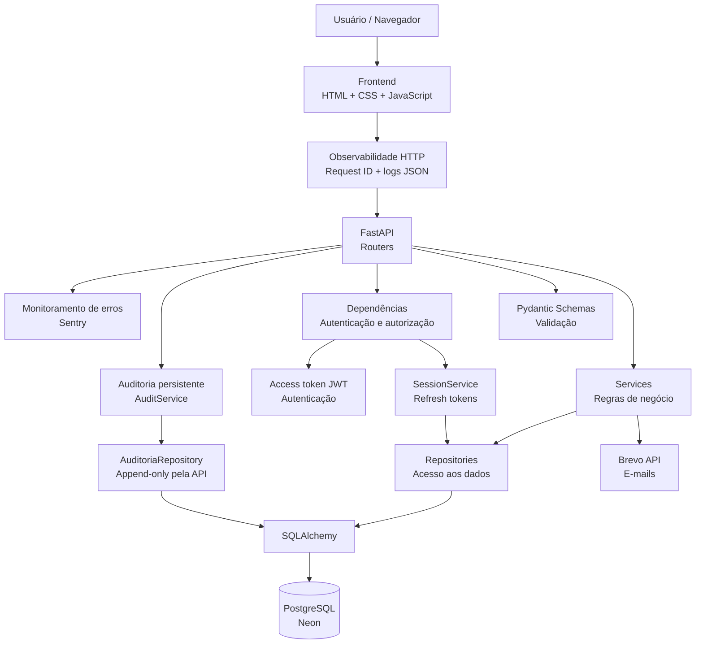

# Arquitetura da Locadora

Este documento apresenta a arquitetura atual da Locadora, mostrando como os principais componentes da aplicação se relacionam desde o frontend até o banco de dados e os serviços externos.

## Visão geral

A Locadora utiliza uma arquitetura em camadas para separar responsabilidades entre interface, API, regras de negócio e persistência de dados.



## Observabilidade HTTP

A camada HTTP gera um `request_id` UUID para cada requisição e devolve o mesmo valor no cabeçalho `X-Request-ID`. Ao final do processamento, a aplicação registra uma linha JSON com os campos principais da requisição:

- evento;
- request ID;
- método HTTP;
- caminho da rota;
- status HTTP;
- duração em milissegundos.

Os logs não incluem query string, cabeçalhos ou corpo da requisição. Eventos importantes de autenticação também são registrados com um conjunto restrito de campos, evitando o armazenamento de senha, token JWT ou token de recuperação.

Exemplo conceitual:

```json
{"level":"INFO","event":"http.request","request_id":"...","method":"GET","path":"/health","status_code":200,"duration_ms":4.12}
```

## Monitoramento de erros

A aplicação possui integração opcional com Sentry para capturar exceções não tratadas em produção com stack trace e contexto técnico. A integração só é ativada quando `LOCADORA_SENTRY_DSN` está configurada, portanto desenvolvimento local e testes continuam funcionando sem depender do serviço externo.

O `request_id` criado pela camada de observabilidade é associado ao escopo isolado da requisição no Sentry. Isso permite correlacionar uma exceção exibida no monitoramento com a linha correspondente dos logs estruturados.

Para reduzir exposição de dados, a configuração usa `send_default_pii=False` e um filtro `before_send`. Antes do envio, são removidos body, query string, cookies, headers, dados de ambiente da requisição e dados de usuário. A URL é mantida apenas sem query string.

Variáveis usadas:

- `LOCADORA_SENTRY_DSN`: ativa o envio de erros ao projeto Sentry;
- `LOCADORA_AMBIENTE`: identifica o ambiente, como `development`, `test` ou `production`.

Nesta etapa o foco é monitoramento de **erros**, não tracing de desempenho. Por isso `traces_sample_rate` permanece em `0.0`.

## Auditoria persistente

A Etapa 7 adiciona uma trilha persistente para ações sensíveis realizadas por usuários autenticados. O objetivo é responder **quem fez**, **o que fez**, **em qual recurso** e **quando**, mantendo correlação com o `request_id` da observabilidade HTTP.

Cada registro contém apenas metadados controlados:

- ID e nome de usuário do ator;
- perfil (`admin` ou `cliente`);
- ação, como `veiculo.editado` ou `cliente.desativado`;
- tipo e identificador do recurso afetado;
- nomes dos campos alterados, sem armazenar os valores;
- `request_id`;
- data/hora em UTC.

A tabela `audit_logs` é escrita pelo `AuditoriaRepository` e consultada por meio de `GET /api/v1/auditoria`, rota restrita a administradores. A API não oferece endpoints para editar ou excluir registros de auditoria.

São auditadas, nesta etapa, ações autenticadas de alteração de estado: cadastro/edição/ativação de veículos, ativação/desativação de clientes, abertura/finalização de manutenção, criação/devolução de aluguel e alteração do próprio nome de usuário. Login e recuperação de senha continuam registrados como eventos estruturados da camada de observabilidade, sem duplicação na tabela de auditoria.

Por segurança, valores de campos não entram no histórico e nomes sensíveis como senha, token, JWT, segredo, API key ou DSN são filtrados pelo `AuditoriaService`.

### Consistência da auditoria

Os Services atuais confirmam suas próprias transações de negócio antes do registro de auditoria. Por isso, uma falha isolada ao gravar `audit_logs` não pode fazer a API responder `500` depois que a operação principal já foi confirmada no banco. Nessa situação, a aplicação registra `audit.write_failed` nos logs estruturados e envia a exceção ao Sentry.

Esse é um compromisso explícito da arquitetura atual. Uma garantia atômica entre ação de negócio e audit log exigiria uma unidade de trabalho/transação compartilhada e pode ser tratada na etapa futura de concorrência e consistência transacional.
## Versionamento da API

A Etapa 8 estabelece `/api/v1` como prefixo canônico da API HTTP. Os mesmos Routers continuam concentrando endpoints e regras de dependência; o versionamento é aplicado no registro dos Routers em `api/main.py`, evitando duplicar Services, Repositories ou regras de negócio.

Fluxo canônico:

```text
Frontend
   ↓
/api/v1
   ↓
FastAPI Routers
   ↓
Services
   ↓
Repositories
```

Durante a migração, os caminhos antigos sem `/api/v1` permanecem registrados com `include_in_schema=False`. Dessa forma, consumidores antigos continuam funcionando temporariamente, mas Swagger/OpenAPI apresentam apenas a versão canônica.

O frontend centraliza o prefixo em `frontend/js/api.js`, por meio de `API_BASE = "/api/v1"`. Assim, os módulos de tela continuam chamando funções como `login()` e `getVehicles()` sem conhecer a estratégia de versionamento.

Rotas operacionais e de infraestrutura não são versionadas: `/health` continua estável para o Render, e `/app` continua sendo o ponto de entrada do frontend estático.

## Refresh tokens e sessões persistentes

A Etapa 9 separa a autenticação em dois componentes. O **access token** continua sendo um JWT de curta duração enviado no cabeçalho `Authorization`. O **refresh token** passa a representar uma sessão persistente e é mantido somente em cookie `HttpOnly`, impedindo que o JavaScript do frontend leia seu valor diretamente.

Fluxo principal:

```text
login válido
   ↓
SessaoService cria refresh token aleatório
   ↓
SHA-256(refresh token) → tabela sessoes
refresh token puro → cookie HttpOnly
   ↓
access token JWT com sid da sessão
   ↓
JWT expira
   ↓
POST /api/v1/auth/refresh
   ↓
refresh token é validado e rotacionado
   ↓
novo access token + novo cookie HttpOnly
```

A tabela `sessoes` guarda `usuario_id`, hash do refresh token, criação, expiração, último uso e estado de revogação. O valor puro do refresh token não é persistido. A rotação substitui o hash anterior, de forma que um refresh token já utilizado não pode ser reutilizado.

Novos access tokens incluem a claim `sid`. `get_usuario_atual` continua validando assinatura, expiração e usuário, mas também consulta a sessão quando `sid` está presente. Isso faz com que logout, revogação individual ou revogação de todas as sessões invalide imediatamente os novos access tokens relacionados. Durante a transição, JWTs emitidos antes da Etapa 9 e sem `sid` continuam aceitos somente até a expiração natural.

O frontend mantém o access token no `sessionStorage`, como antes. Ao receber `401`, `frontend/js/api.js` tenta uma única renovação automática e repete a requisição original. Uma Promise compartilhada evita que várias requisições simultâneas tentem rotacionar o mesmo refresh token ao mesmo tempo.

A redefinição de senha revoga as sessões persistentes da conta antes da troca da credencial. Dessa forma, uma sessão já autenticada não permanece válida após uma recuperação de senha.
